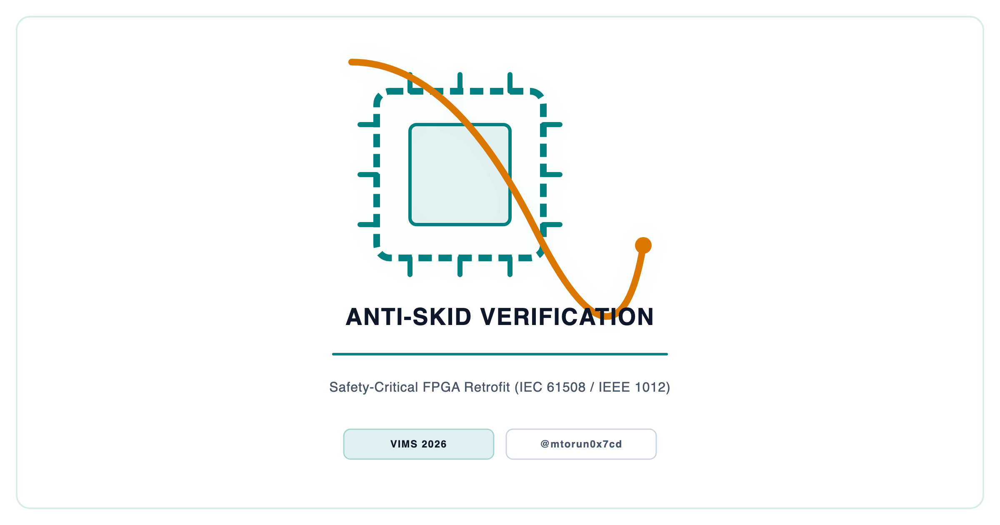
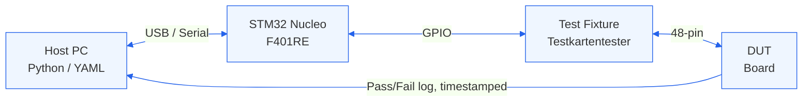

<p align="center">
  <picture>
    <source media="(prefers-color-scheme: dark)" srcset="docs/social_preview_dark.png" />
    <source media="(prefers-color-scheme: light)" srcset="docs/social_preview_light.png" />
    
  </picture>
</p>

# Ensuring Functional Equivalence in Retrofitted Anti-Skid Systems for European Public Transportation

> A two-layer verification methodology for safety-critical FPGA retrofits in urban rail — demonstrating functional equivalence through convergent evidence from VHDL simulation, hardware timing measurement, and YAML-driven scenario testing.

[](https://github.com/mtorun0x7cd/anti-skid-verification/actions/workflows/ci.yml)
[](https://github.com/mtorun0x7cd/anti-skid-verification/actions/workflows/docs.yml)


[](https://creativecommons.org/licenses/by-nc-nd/4.0/)

---

## Overview

Anti-skid (wheel-slide protection) systems are safety-critical components in European urban rail vehicles, preventing wheel lock-up during braking on low-adhesion track. The system studied here, deployed across multiple European transit operators, relies on a test-diagnosis module built around the long-obsolete Intel MCS-48 microcontroller family. As these components become unobtainable, operators face a choice between prohibitively expensive full system replacement or targeted board-level retrofit — provided functional equivalence with the original design can be rigorously demonstrated under contemporary safety standards.

This research project addresses the verification challenge by developing a structured, standards-aligned **two-layer verification methodology** derived from the V-model lifecycle of IEC 61508, with verification and validation activities structured per IEEE 1012. The replacement architecture pairs an **Actel A3P1000 FPGA** (flash-based, non-volatile) emulating the MCS-48 CPU and I/O logic with an **STM32F401RET6** ARM Cortex-M4 microcontroller providing galvanically isolated diagnostics. The central contribution is not the hardware itself, but the **methodological framework** for proving functional equivalence — a gap that existed in the literature for board-level legacy-to-FPGA retrofit scenarios.

An accompanying IEEE-format paper has been accepted for publication in *Kölner Beiträge zur technischen Informatik* (ISSN 2193-570X). Lifecycle considerations indicate that board-level retrofits reduce both operational costs and embodied carbon relative to manufacturing new subsystems, supporting the economic and ecological rationale alongside the technical methodology.

## Abstract

Modernising ageing safety-critical electronics in public transportation is often more cost-effective and environmentally sustainable than complete system replacement — provided functional equivalence with the original design can be rigorously demonstrated under contemporary safety standards. This paper presents a case study of retrofitting a legacy anti-skid test-diagnosis module used in European urban rail. An obsolete Intel MCS-48 microcontroller was replaced with a flash-based Field-Programmable Gate Array (FPGA; Actel A3P1000) emulating the original processor and I/O logic, complemented by a galvanically isolated STM32 microcontroller subsystem for enhanced diagnostics. To verify the retrofit, a two-layer verification methodology was developed, derived from the V-model lifecycle of IEC 61508, with verification and validation activities structured per IEEE 1012: (1) deterministic component and interface testing via VHDL simulation and hardware timing measurements, and (2) scenario-based system-level testing using a dedicated hardware fixture with YAML-defined test cases. Through convergence of three independent evidence lines — simulation, oscilloscope measurement, and integrated scenario testing — functional equivalence of the safety-critical core was demonstrated for all documented fault codes, self-test sequences, and user interactions. Results were mapped to IEC 61508, EN 50129, EN 50716, and IEEE 1012. The methodology is assessed for transferability to other safety-critical retrofit contexts.

## Context

| Dimension | Detail |
| :--- | :--- |
| **Institution** | TH Köln (University of Applied Sciences) |
| **Faculty** | Information, Media and Electrical Engineering |
| **Program** | Computer Science & Engineering (Technische Informatik), M.Sc. |
| **Type** | Independent Research Publication |
| **Supervisor** | Prof. Dr. Tobias Krawutschke |
| **Date** | August 2025 |
| **Presented** | VIMS 2026 |
| **Publication** | *Kölner Beiträge zur technischen Informatik* (ISSN 2193-570X), in press |
| **ePublications** | Research report to be archived in TH Köln's [institutional repository](https://epb.bibl.th-koeln.de/); persistent URN/DOI added once assigned |

## Features

- **Two-layer verification methodology** — Standards-aligned (IEC 61508 / IEEE 1012) framework combining white-box component testing with black-box system validation, structured around the V-model
- **FPGA-based MCS-48 emulation** — Actel A3P1000 flash-based FPGA running an MCS-48 emulation core (the OpenCores `t48_core`, integrated unmodified) executing the original 2 KB firmware binary (preserved bit-exact) from external Flash ROM (S29AL016J)
- **Galvanically isolated diagnostics** — STM32F401RET6 ARM Cortex-M4 subsystem with optocoupler-isolated SPI, RTC-timestamped SD card logging, and USB Type-C data retrieval
- **YAML-driven test specification** — Machine-parseable, version-controlled test case definitions with requirements-to-test traceability matrices
- **Empirical bug taxonomy** — Five distinct defect classes (logical, layout, assembly, firmware, interface) discovered and classified during validation
- **Digital frequency sweep generator** — Division-counter logic replacing the legacy analog VCO, covering 850 Hz – 1550 Hz across 33 up-sweep and 65 down-sweep steps
- **Deterministic reproducible builds** — `latexmk` with `SOURCE_DATE_EPOCH` enforcement for byte-identical PDF output across builds

## Architecture

The retrofit replaces a single 8-bit microcontroller board with a modular, four-PCB dual-processor architecture. The safety-critical FPGA core and non-safety diagnostics subsystem are separated by a galvanic isolation boundary (optocouplers + independent DC/DC converters), ensuring fault non-propagation.

### Dual-Processor System

```text
┌───────────────────────────────────────────────────────────────────────────────────────┐
│                                Legacy Anti-Skid System                                │
├─────────────────────────────────────────────┬─────────────────────────────────────────┤
│ SAFETY-CRITICAL DOMAIN                      │ NON-SAFETY DIAGNOSTICS DOMAIN           │
│                                             │                                         │
│ PCB 1 — Base Board                          │ PCB 3 — STM32 Diagnostics               │
│ ┌────────────────────────────────────┐      │ ┌────────────────────────────┐          │
│ │ Actel A3P1000 FPGA (PQG208)        │      │ │ STM32F401RET6 (Cortex-M4)  │          │
│ │   • MCS-48 CPU core (t48_core)     │      │ │   • FatFS SD-card logger   │          │
│ │   • Flash ROM (S29AL016J)          │      │ │   • DS3231SN RTC (battery) │          │
│ │   • NVRAM (CY14B104NA)             │      │ │   • USB Type-C retrieval   │          │
│ │   • Freq. sweep gen. (850–1550 Hz) │      │ └────────────────────────────┘          │
│ │   • Watchdog + BOD (TPS3307)       │      │                                         │
│ └────────────────────────────────────┘      │ PCB 4 — LED Display                     │
│                                             │ ┌───────────────────────────┐           │
│ Power:  TPS73615 (1.5 V) · TPS73633 (3.3 V) │ │ CD4511BE → 7-seg displays │           │
│ Debug:  JTAG (IEEE 1149.1)                  │ │   (SC03-12EWA × 2)        │           │
│                                             │ └───────────────────────────┘           │
│                                             │                                         │
│                                             │ PCB 2 — Upper Board                     │
│                                             │ ┌─────────────────────────────────────┐ │
│                                             │ │ Buttons: Test · STW · Lösch · Tür/V │ │
│                                             │ │   + debounce + level shift          │ │
│                                             │ └─────────────────────────────────────┘ │
├─────────────────────────────────────────────┴─────────────────────────────────────────┤
│ Galvanic isolation: SPI @ 100 kHz across SFH601-3 × 4 optocouplers                    │
│ (separate DC/DC rails); BCD from the FPGA drives the LED display.                     │
└───────────────────────────────────────────────────────────────────────────────────────┘
```

### Two-Layer Verification Methodology

The methodology maps to the right side of the V-model through two complementary verification layers:

**Layer 1 — Deterministic Component & Interface Testing** targets unit and integration testing: white-box verification proving that individual VHDL modules and hardware interfaces are correctly implemented against their technical specifications.

| Technique | Target | Evidence |
| ----------- | -------- | ---------- |
| VHDL Simulation (ModelSim ME) | MCS-48 core, memory interfaces, SPI master, frequency sweep, watchdog | Cycle-accurate waveforms |
| JTAG Boundary-Scan (IEEE 1149.1) | FPGA identification, pin connectivity, solder defect isolation | Pin-level state verification |
| Oscilloscope Measurement | Watchdog interaction (3.85 s servicing window measured), frequency sweep (850–1550 Hz) | Temporal equivalence evidence |

**Layer 2 — Scenario-Based System-Level Testing** targets system and acceptance testing: black-box validation of the fully integrated system against original functional requirements using a dedicated hardware test fixture ("Testkartentester").



Test cases are defined in YAML with full traceability to requirements:

```yaml
- name: Geber 3 - I
  description: >-
    Simulate sensor fault on axle 3. Wait 3 s for
    error display, then hold STW to verify sequence.
  pin_sets: {18z: 1, 24d: 0}
  expected_err_code: "31"
  expected_err_seq: "03 31 09"
  del: False
```

### Diagnostic Blind Spot & Evidence Convergence

The methodology's necessity is empirically validated through a taxonomy of five distinct integration bugs discovered during validation:

| ID | Class | Description | Detected By |
| ---- | ------- | ------------- | ------------- |
| B1 | Logical | NVRAM byte-low-enable (`NVRAM_ble`) held high — memory disabled | Layer 1 (Simulation) |
| B2 | Layout | STM32 SWD debug pins routed incorrectly | Layer 1 (Boundary-Scan) |
| B3 | Assembly | ~40 FPGA pins open or shorted from soldering | Layer 1 (JTAG / Scope) |
| B4 | Firmware | FatFS timing starvation blocking SPI Rx | Layer 2 (Fixture/YAML) |
| B5 | Interface | SPI payload truncation (16-bit vs 32-bit buffer) | Layer 2 (Fixture/USB) |

Bugs B1–B3 escaped system-level testing; bugs B4–B5 escaped component simulation. Neither layer alone was sufficient — their convergence is essential for safety-critical retrofit assurance.

## Tech Stack

| Category | Technologies |
| ---------- | ------------- |
| Document Preparation | LaTeX (IEEEtran class), BibTeX and BibLaTeX/Biber, `latexmk` |
| Hardware Description | VHDL (targeting Actel A3P1000 FPGA via Microsemi Libero SoC) |
| Diagnostics Firmware | C (STM32F401RET6, ARM Cortex-M4, HAL + FatFS) |
| Simulation | ModelSim ME (pre- and post-synthesis) |
| Test Specification | YAML (scenario definitions, requirements-to-test traceability matrices) |
| Build Automation | GNU Make with deterministic reproducible builds (`SOURCE_DATE_EPOCH`) |
| Version Control | Git (configuration management per EN 50716) |
| Standards Framework | IEC 61508, EN 50129, EN 50716, EN 50155, IEEE 1012 |

## Project Structure

```text
anti-skid-verification/
├── paper/                  # IEEE conference paper (LaTeX)
│   ├── paper.tex           # Main paper source
│   ├── references.bib      # Paper bibliography
│   ├── IEEEtran.cls        # IEEE LaTeX class
│   └── fig/                # Paper figures (SVG source, PNG included)
├── report/                 # Comprehensive research report (LaTeX)
│   ├── report.tex          # Main report source
│   ├── chapters/           # Chapter sources (7 chapters + 5 appendices)
│   ├── abstract/           # Abstracts (EN/DE)
│   ├── bib/                # Report bibliography
│   ├── fig/                # Figures, schematics, PCB layouts
│   ├── abbreviations/      # Glossary definitions
│   ├── keywords/           # Keywords (EN/DE)
│   └── meta/               # Metadata (title, author, institution)
├── verification/           # Test artefacts
│   └── test_traceability.yaml  # Requirements-to-test traceability matrix
├── slides/                 # VIMS 2026 talk deck (LaTeX Beamer)
│   ├── deck_preamble.tex   # Shared deck preamble
│   ├── deck_frames.tex     # Slide frames (only the presentation builds from these)
│   ├── presentation.tex    # Deck driver
│   └── handout.tex         # Standalone A4 handout (independent of the deck)
├── docs/                   # Social-preview assets only (compiled PDFs are release artifacts)
│   ├── social_preview.svg
│   ├── social_preview_light.png
│   ├── social_preview_dark.png
│   ├── social_card.png
│   └── render.sh
├── .github/workflows/      # CI: build paper, report, and slides
├── CITATION.cff            # How to cite this work
├── SECURITY.md             # Security and reporting policy
├── LICENSE                 # CC BY-NC-ND 4.0 (full legal text)
├── NOTICE                  # Copyright and third-party licenses
├── Makefile                # Deterministic build script
├── .latexmkrc              # latexmk configuration
├── .chktexrc               # LaTeX linting rules
├── .editorconfig           # Editor configuration
└── .gitattributes          # Git line-ending rules
```

## Getting Started

### Prerequisites

- [TeX Live](https://www.tug.org/texlive/) (full installation) or [MacTeX](https://www.tug.org/mactex/)
- `latexmk` (included with TeX Live)
- `biber` (BibLaTeX backend)
- `makeglossaries` (for abbreviation processing)
- GNU Make

### Build & Run

```bash
# Build all deliverables (paper + report + slides)
make all

# Lint all LaTeX sources
make check

# Clean build artefacts
make clean
```

Compiled PDFs are staged under `.tmp.nosync/dist/` locally and are **not** tracked in Git. The CI pipeline builds them on every push and attaches the paper, the report, the presentation deck, and the printable handout to each tagged release — download them from the [latest release](https://github.com/mtorun0x7cd/anti-skid-verification/releases/latest).

### Reproducible Builds

The Makefile enforces deterministic builds via `SOURCE_DATE_EPOCH` (derived from the latest Git commit timestamp), ensuring byte-identical PDF output across builds for the same source revision.

## Documentation

| Document | Description |
| ---------- | ------------- |
| [IEEE Paper](https://github.com/mtorun0x7cd/anti-skid-verification/releases/latest/download/paper.pdf) | Paper accepted for publication in *Kölner Beiträge zur technischen Informatik* (ISSN 2193-570X) |
| [Research Report](https://github.com/mtorun0x7cd/anti-skid-verification/releases/latest/download/report.pdf) | Comprehensive report with full methodology, schematics, PCB layouts, and appendices |
| [Test Traceability Matrix](verification/test_traceability.yaml) | YAML-defined requirements-to-test mapping for SPI and data logger modules |
| [Presentation](https://github.com/mtorun0x7cd/anti-skid-verification/releases/latest/download/presentation.pdf) | VIMS 2026 talk deck (printable [handout](https://github.com/mtorun0x7cd/anti-skid-verification/releases/latest/download/handout.pdf) alongside) |

## References

[1] IEC, "IEC 61508: Functional Safety of Electrical/Electronic/Programmable Electronic Safety-Related Systems," Edition 2.0, International Electrotechnical Commission, 2010.

[2] CENELEC, "EN 50129: Railway Applications — Communication, Signalling and Processing Systems — Safety Related Electronic Systems for Signalling," European Committee for Electrotechnical Standardization, 2018.

[3] CENELEC, "EN 50716: Railway Applications — Requirements for Software Development," European Committee for Electrotechnical Standardization, 2023.

[4] CENELEC, "EN 50155: Railway Applications — Rolling Stock — Electronic Equipment," European Committee for Electrotechnical Standardization, 2021.

[5] IEEE, "IEEE 1012-2024: IEEE Standard for System, Software, and Hardware Verification and Validation," Institute of Electrical and Electronics Engineers, 2024.

## Citation

If you reference this work, please cite the accompanying paper. Machine-readable metadata is in [CITATION.cff](CITATION.cff) (GitHub renders a "Cite this repository" control from it).

> Torun, M. (2026). *Ensuring Functional Equivalence in Retrofitted Anti-Skid Systems for European Public Transportation: A Hybrid Two-Layer Verification Methodology.* Kölner Beiträge zur technischen Informatik (ISSN 2193-570X). In press.

## Security

See [`SECURITY.md`](SECURITY.md) for the security stance and how to report issues.

## License

The works in this repository authored by Mert Torun — the paper, the research report, the presentation and handout, the verification artefacts, and supporting text and figures — are licensed under the [Creative Commons Attribution-NonCommercial-NoDerivatives 4.0 International License](https://creativecommons.org/licenses/by-nc-nd/4.0/) (CC BY-NC-ND 4.0): share them unmodified, with attribution, for non-commercial purposes. See [LICENSE](LICENSE) for the full terms and [NOTICE](NOTICE) for attribution and third-party licenses.

> **Note on third-party files.** The LaTeX class and bibliography style `paper/IEEEtran.cls` and `paper/IEEEtran.bst` are the work of the IEEEtran project, redistributed unmodified under the LaTeX Project Public License (LPPL), and are not covered by the license above.
>
> **Note on the FPGA core.** The MCS-48 emulation described in this work integrates the unmodified OpenCores `t48_core`, which is distributed under the **GPL-2.0** license. The corresponding HDL is not redistributed here; this repository contains only the paper, the report, the slides, and the verification artefacts.

## Contact

**Mert Torun, M.Sc.** — IT Security Architect · Systems Engineer  
mtorun0x7cd · Research & Development

His work spans the verification and validation of safety-critical systems, infrastructure hardening, and cryptographic integrity, grounded in an M.Sc. in Computer Science & Engineering from TH Köln. This repository accompanies the accepted paper and the comprehensive research report behind it.

- **Email**: [info@mtorun0x7cd.com](mailto:info@mtorun0x7cd.com)
- **Website**: [mtorun0x7cd.com](https://mtorun0x7cd.com)
- **LinkedIn**: [linkedin.com/in/mtorun0x7cd](https://www.linkedin.com/in/mtorun0x7cd)
- **GitHub**: [github.com/mtorun0x7cd](https://github.com/mtorun0x7cd)
